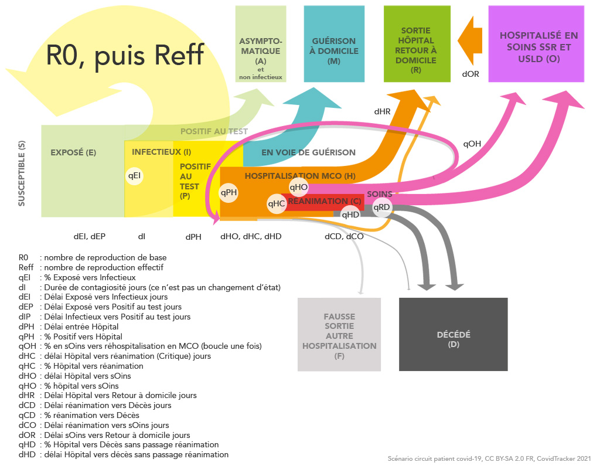

# SIMULATOR CT
Le simulateur CT CovidTracker a pour objectif de reproduire les courbes de la situation sanitaire pour la gestion de la covid-19 en France, en s'appuyant sur les données de Santé publique France (valeurs à atteindre par le calcul).

## Présentation du simulateur CT 

Description du modèle de calcul sur tableur

---

### Les états

Modèle épidémilogique à compartiments (états) à calcul discret (journalier), une lettre capitale = un état

* S : (s)usceptible d'être infecté
* E : (e)xposé au virus, le virus a pénétré l'organisme
* I : (i)nfectieux donc contagieux
* A : (a)symptomatique, au sens où l'individu est exposé mais il ne développera pas la maladie _et_ ne sera pas contagieux
* P : (p)ositif au dépistage et infectieux (remarque : les personnes non infectieuses sont rapidement sorties du process de calcul)
* H : (h)ospitalisé
* C : (c)ritique, hospitalisation en réanimation
* O : en s(o)ins de suite, la maladie est vaincue (EN : to Overcome) mais le patient n'est pas totalement guéri.
* R : (r)etour à domicile donc guéri
* D : (d)écédé
* B : en (b)oucle de réhospitalisation
* V : (v)ielle personne contaminée (EN : vintage), pensionnaire en EHPAD et EMS
* W : pentionnaire EHPAD ou EMS décédé
* M : (m)alade à la maison
* F : (f)ausse sortie, des patients qui sortent de l'hospitalisation covid vers une autre hospitalisation

---

Remarque sur la sortie F: elle n'est modélisée que sur la branche Boucle. En réalité elle existe certainement sans passer par la boucle, mais jusqu'à présent dans le modèle numérique cette simplication ne pose pas de problème.

---

### Les changements d'état

Une lettre minuscule = un changement d'état

* i : entrée dans l'état (IN)
* o : sortie de (OUT)

---

### Les opérations

Une consonne minuscule = un calcul

* q : quota (un pourcentage)
* s : somme (un cumul)
* d : délai, avant un changement d'état
* j : le jour j
* e : écart

---

### Liste des variables

Variable	Description	Ligne de calcul

* qEI	% exposé vers infectieux	S1-03
* dI	Durée de contagiosité jours (ce n’est pas un changement d’état)	S1-04
* dEI	Délai Exposé vers Infectieux jours	S1-05
* dEP	Délai Exposé vers Positifs au test jours	S1-06
* dIP	Délai Infectioeux vers Positif au test jours	S1-07
* dPH	Délai entrée hôpital	S2-03
* qPH	% Positif vers hôpital	S2-04
* qOB	% sOins vers réhospitalisation Boucle	S2-05
* dHC	délai Hôpital vers réanimation (Critique) jours	S2-06
* qHC	% Hôpital vers réanimation	S2-07
* dHO	délai Hôpital vers sOins	S2-08
* qHO	% Hôpital vers sOins	S2-09
* dHR	Délai Hôpital vers retour à domicile	S2-10
* dCD	Délai réanimation vers Décès jours	S2-11
* qCD	% réanimation vers Décès	S2-12
* dCO	Délai réanimation vers sOins jours	S2-13
* dOR	Délai sOins vers Retour à domicile jours	S2-14
* dOB Délai sOins vers réhospitalisation Boucle S2-15
* dBF Délai réhospitalisation Boucle vers Fausse sortie S2-18
* qBD	% réhospitalisation Boucle vers Décès	S2-19
* dBD	délai réhospitalisation Boucle vers Décès	S2-20
* qMV	% nouvelles guérisons seuls (M) vers nouveaux tests positifs en EHPAD et EMS  S2-21
* dMV	délai contamination vers positifs EHPAD et EMS jours	S2-22
* qHD	% Hôpital vers Décès sans passage réanimation	S2-23
* dHD	délai Hôpital vers Décès sans passage réanimation	S2-24
* qVD	% Positifs vers Décès en EHPAD et EMS	S2-25
* dVD	délai Positifs vers Décès en EHPAD et EMS	S2-26
* dBR	délai réhospitalisation Boucle vers retour à domicile jours	S2-27
* qBR	% sortie réhospitalisation Boucle vers retour à domicile scénario eXtrange	S2-28

---

### Explications des calculs dans les colonnes 

Sheet1 - S1

* S1-A : dates
* S1-B : points de contrôle R pour orienter la courbe de R-effectif. Pour chaque mois il y a 4 points de contrôle, c'est à dire 4 valeurs de R à choisir, le 1er puis le 10, puis le 20, puis le 30 ou le 31 du mois. Les valeurs intermédiaires des autres jours seront calculées par interpollation de Lagrange.
* S1-C : points de contrôle recalculé, possibilité de réorienter les points de contrôle à la hausse ou à la baisse (variation linéaire) pour faire des hypothèses de tendances. R = R*(1+(variation*jours))
* S1-D, Reff : calculs des valeurs de R-effectif au jour le jour selon une interpollation de Lagrange en fonctions de 4 points de contrôle recalculés par mois . 
* S1-E, Reff2 : calcul d'une deuxième valeur de R-effectif (Reff2) qui est augmentée pour tenir compte d'une hypothèse où seules les personnes infectieuses sont contaminantes. Reff2 = Reff/qI
* S1-K, Ei : entrées quotidiennes dans l'état exposé E, dépend du nombre de personnes infectieuses I, Ei = Ii*Reff2(j-dI)
* S1-L, Es : somme des personnes exposées, Es = Es(j-1)+Ei
* S1-M, Ai : entrées quotidiennes dans l'état asymptomatique A, dépend du nombre de nouvelles personnes exposées et qui ne seront pas infectieuses, Ai = Ei(j-dEI)*(1-qEI)
* S1-N, A : cumul des personnes asymptomatiques A, A = A(j-1)+Ai
* S1-O, Ii : entrées quotidiennes à l'état infectieux I, dépend du nombre de nouvelles personnes exposées et qui seront infectieuses, Ii = Ei(j-dEI)*qEI
* S1-P, Ps : sommes des personnes infectieuses et positives aux tests, dépend de la somme des personnes infectieuses I avec un décalage dans le temps. Ps = Ps(j-1) + Ii(j-dIP)
* S1-Q, Ps lissé moyenne mobile 5 jours, pour amoindrir les fluctuations de calcul.
* S1-R, P(tous), tous les positifs y compris les asymptomatiques, pour comparaison avec les données SPF, correspond à tous les exposés en fonction d'un délai pour le résultat aux tests, P(tous) = Es(j-dEP)
* S1-S, P(SPF), tous les positifs selon les données SPF (import de données), pour comparaison

---

Sheet2 - S2

* S2-A : dates (les mêmes qu'en S1-A)
* S2-J, P(tous) : tous les positifs, rappel de la colonne S1-R
* S2-K, A : tous les asymptomatiques, rappel de la colonne S1-N
* S2-L, P(SPF) : tous les positifs selon SPF, rappel de la colonne S1-S
* S2-M, Pi : incidence quotidienne de nouveaux Positifs à l'état P, Pi=Ps-Ps(j-1)
* S2-N, Hi : incidence quotidienne des nouvelles entrées en hospitalisation, dépend du pourcentage de positifs qui passent à l'hôpital selon un délai dPI, Hi=Pi(j-dPH)*qPH
* S2-O, His : somme de toutes les entrées à l'hôpital, Hs = Hs(j-1)+Hi
* S2-P, Ci : incidence quotidienne de nouvelles entrées en réanimation, dépend des nouvelles entrées en hospitalisation selon un délai, Ci = Hi(j-dHC)*qHC
* S2-Q, Cis : somme de toutes les entrées en réanimation, Cis = Cis(j-1)+Ci
* S2-S, CDi : incidence quotidienne des nouveaux décès en services de réanimation, dépend des nouvelle entrées en réanimation selon un quota de décès et un délai, CDi = Ci(j-dCD)*qCD
* S2-T, HDi : incidence quotidienne des nouveaux décès en hospitalisation conventionnelle, dépend des nouvelles entrées en hospitalisation, selon un délai et un quota, HDi = (Hi(j-dHD)-Ci(j-dHD))*qHD
* S2-U, HDs : somme des patients décédés en hospitalisation conventionnelle, HDs = HDs(j-1)+HDi
* S2-V, Di : incidence quotidienne des nouveaux décès, somme des décès quotidiens en réanimation et en hospitalisation conventionnelle, Di = CDi+HDi
* S2-W, D : somme des décès hospitaliers, Ds = Ds(j-1) + Di
* S2-X, CDs : somme des décès en services de réanimation, CDs = CDs(j-1)+CDi
* S2-Y, C2Os : somme des patients en réanimation qui iront en SSR (ils ne vont pas décéder), C2Os = Cis-CDs
* S2-Z, COis : somme des patients entrés en SSR, c'est un décalage dans le temps de C2Os, COis = C2Os(j-dCO)
* S2-AA, COi : incidence quotidienne des nouvelles entrées en SSR, COi = COis-COis(j-1)
* S2-AB, OBs : cumul des entrées en réhospitalisation, OBs = OB(j-1)+HOi(j-dOB)*qOB
* S2-AC, Cos : cumul des sorties des services de réanimation, soit sute à décès, soit suite à passage en SSR, Cos = Cos(j-1)+CDi+COi
* S2-AD, HOi : incidence quotidienne des arrivées en SSR directement depuis l'hospitalisation conventionelle, dépend des nouvelles arrivées en hospitalisation selon un quota et un délai, HOi = Hi(j-dHO)*qHO
* S2-AE, HOis : somme des entrées en SSR de la part de personnes arrivant depuis l'hospitalisation conventionnelle, HOis = HOis(j-1)+HOi
* S2-AF, Ois : somme de toutes les entrées en SSR, les entrées depuis les services de réanimation et depuis l'hospitalisation conventionelle, Ois = Ois(j-1)+COi+HOi
* S2-AG, Oi : incidence quotidienne des entrées en SSR, Oi = Ois-Ois(j-1)
* S2-AH, Oos : somme de toutes les sorties de service SSR, dépend de toutes les entrées en SSR avec un décalage dans le temps et de ceux qui sortent de SSR sans passer par la Boucle, Oss = Ois(j-dOR)+(OBs-OBs(j-dOR))
* S2-AI, Oo : sorties quotitiennes des services de SSR, Oo = Oos - Oos(j-1)
* S2-AJ, O : nombre de patients en SSR, différence entre la somme des entrées et la somme des sorties, O = Ois-Oos
* S2-AK, H2Rs : nombre de patients qui pourront sortir de l'hôpital sans passer par un service de réanimation ou de SSR, vu comme le reste des patients qui étant entrés à l'hôpital n'ont pas été dirigés vers un service SSR ou réa, H2Rs = His - (HDs+Cis+HOis)
* S2-AL, HRs : somme des sorties de l'hôpital pour les patients ne passant pas par des services de réa ou SSR, vu comme un décalage dans le temps de H2Rs, HRs = H2Rs(j-dHR)
* S2-AM, HRi : nombre d'entrées quotidiennes à l'état R (qui en en fait une sortie de l'hôpital), de la part des patients en hospitalisation conventionnelle (ni en Rea ni en SSR), HRi = HRs-HRs(j-1)
* S2-AN, Ri : nombre d'entrées quotidiennes à l'état R, c'est à dire toutes les sorties quotidiennes de l'hôpital, Ri = Oo+HRi
* S2-AO, Hos : somme de toutes les sorties de l'hôpital, toutes causes confondues, enlever les entrées en réhospitalisation, Hos = Hos(j-1)+HRi+Di+Oo-Bi+BRi+BFi
* S2-AP, H : nombre de patients hospitalisés, H = His-Hos
* S2-AQ, D : nombre de patients décédés, rappel de S2-W.
* S2-AR, R : nombre de patients retournés à domicile, enlever les entrées en réhospitalisation Boucle, R = Oos + HRs - OBs + BRs + BFs
* S2-AS, C : nombre de patients en soins critiques, C = Cis-Cos
* S2-AT, Mi : incidence quotidienne des nouvelles personnes positives qui ne vont pas être prise en charge l'hôpital, Mi = Pi-Hi
* S2-AU, M : personnes positives qui se sont soignées à domicile, M = M(j-1)+Mi
* S2-AV, Oref : Nombre de patients en SSR, référence SPF
* S2-AW, Href : nombre de patients hospitalisés, référence SPF
* S2-AX, Cref : nombre de patients en réanimation, référence SPF
* S2-AY, Rref : nombre de patients retounés à domicile, référence SPF
* S2-AZ, Dref : nombre de patients décédés, référence SPF
* S2-BA, Vref : nombre de pensionnaires détectés positifs en EHPAD et EMS, référence SPF
* S2-BB, Wref : nombre de pensionaires EHPAD ou EMS décédés, référence SPF
* S2-BC, Hiref : incidence quotidienne des entrées hospitalières, référence SPF
* S2-BD, Ciref : incidence quotidienne des entrées en réanimation, référence SPF
* S2-BE, Diref : incidence quotidienne des nouveaux décès à l'hôpital, référence SPF
* S2-BF, Riref : incidence quotidienne des nouveaux retours à domicile, référence SPF
* S2-BG, Hsref : somme des incidences de référence des entrées hospitalières, Hsref = Hsref(j-1)+Hiref
* S2-BH, Csref : somme des incidences de référence des entrées en réanimation, Csref = Csref(j-1)+Ciref
* S2-BI, Rsref : somme des incidences de référence des sorties hospitalières, Rsref = Rsref(j-1)+Riref
* S2-BJ, Dsref : somme des incidences de référence des décès hospirtaliers, Dsref = Dsref(j-1)+Diref
* S2-BK, Tous : somme des états des personnes passées par l'état P, vu comme toutes les personnes qui se sont soignées à domicile plus tous les patients en cours d'hospitalisation plus tous les patients décédés à l'hôpital plus tous les patients retournés à domicile plus tous les asymptomatiques, Tous = M+H+D+R+A
* S2-BL, dTous : écart delta de Tous avec le nombre de personnes détectées positives, vérification générale, dTous = (P(tous)-Tous)/P(tous)
* S2-BM, sref : Vérification cumul incidences de référence SPF : sref = Hsref-(Rsref+Dsref+Href)
* S2-BP, Vi : incidence nouveaux cas de contaminations en EHPAD et EMS, vu comme un quota avec un délai du nombre des nouvelles personnes qui se soignent sans passer par l'hôpital, Vi = Mi(j-dMV)*qMV
* S2-BQ, Vs : cumul du nombre de cas de contamination en EHPAD et EMS, Vs = Vs(j-1)+Vi
* S2-BR, VDi : incidence quotidienne des décès de pensionnaires EHPAD et EMS, vu comme un décalage avec un quota sur le nombre des nouveaux cas positifs, VDi = Vi(j-dVD)*qVD
* S2-BS, VD : cumul des décès de pensionnaires EHPAD et EMS, VD = VD(j-1)+VDi
* S2-BT, Bi : incidence quotidienne de nouvelles personnes réhospitalisées dans la Boucle, Bi = OBs-OBs(j-1)
* S2-BU, BDi : incidence quotidienne des nouveaux décès dans la branche Boucle, vu comme un déclage et un quota des entrées dans ce scénario, Bdi = Bi(j-dBD)*qBD
* S2-BV, HsBs : somme des entrées dans les deux hospitalisations, HsBs = His+OBs
* S2-BW, BDs : cumul des décès dans la boucle hospitalière, BDs = BDs(j-1)+BDi
* S2-BX, BFi : incidence quotidienne des fausses sorties (puisées dans la boucle) vers autre hospitalisation, vu comme un décalage dans le temps des personnes entrées dans la boucle mais qui ne sortent ni pour cause de décès, ni pour cause de retour à domicile, BFi = Bi(j-dBF)*(1-qBD-qBR)
* S2-BY, F : somme des personnes sorties vers autres hospitalisations, F = F(j-1)+BFi
* S2-BZ, BRstemp : calcul intermédiaire du cumul des patients de la boucle qui pourront retourner à domicile, vu comme la somme des entrées en réhospitalisations selon un décalage dans le temps moins la somme des autres sorties que celle pour le retour à domicile c'est à dire moins les sorties déjà constatés pour décès ou autre hospitalisation, BRstemp = OBs(j-dBR)-BDs-BFs
* S2-CA, BRs : cumul des patients retournés à domicile depuis la réhospitalisation Boucle, vu comme l'évolution de l'indicateur précédent sachant qu'il ne peut qu'augmenter, BRs = max(BRs(j-1);BRstemp)
* S2-CB, BRi : incidence quotidienne des nouveaux retours à domicile depuis la réhospitalisation Boucle, BRi = BRs-BRs(j-1)
* S2-CC, FR : somme des sorties pour retour à domicile ou hospitalisation autre que covid, FR = F+R
* S2-CD, DD : somme des décès avec les deux scénarios, DD = D+BDs
* S2-CE, Bio : calcul du nombre de patients en hospitalisation dans la branche Boucle, vu comme la différence entre toutes les entrées et toutes les sorties, Bio = OBs-(BDs+BFs+BRs)
* S2-CF, eHB : Vérification écarts toutes Hospitalisations avec Boucle, eHB = sref-(Bio+F)

